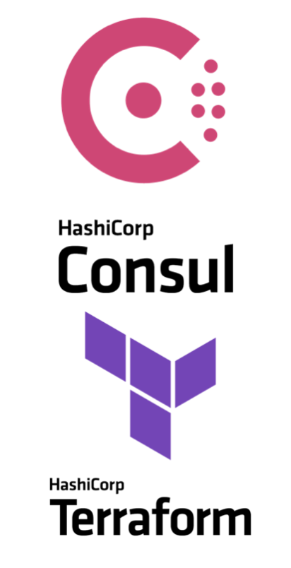

layout: true
class: img-left-full
background-image: url(../../assets/images/backgrounds/HashiCorp-Content-bkg.png)
background-size: cover
name: slide1

# Agenda

* Why Consul-Terraform-Sync
* Benefits of Consul-Terraform-Sync
* Use Case Example
* Example Code
* Technology Provider Partners
* Q&A

???

This is going to be an overview of an advanced feature of Consul called Consul-Terraform-Sync. This presentation assumes you have a basic understanding of both Consul and Terraform.

Go over Agenda items.

* Why Consul-Terraform-Sync
* Benefits of Consul-Terraform-Sync
* Use Case Example
* Example Code
* Technology Provider Partners
* Q&A

At the end of the presentation, you should have a basic understanding of the Consul-Terraform-Sync feature and why you might want to utilize it's capabilities. Links to additional resources will be provided at the end.

---
