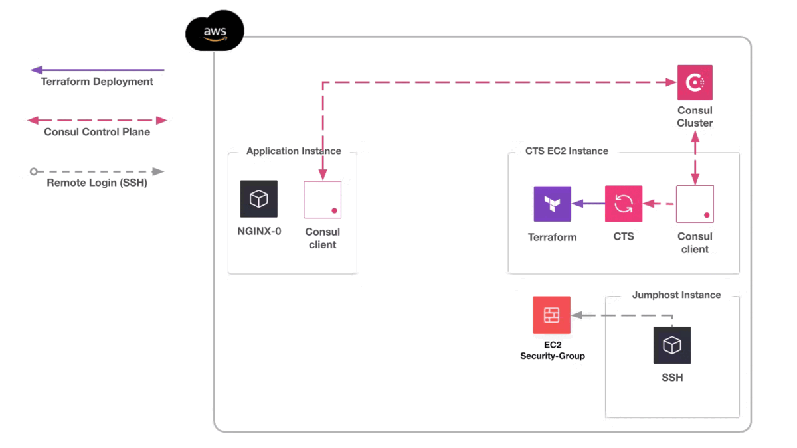

layout: true
class:
background-image: url(../../assets/images/backgrounds/HashiCorp-Content-bkg.png)
background-size: cover
name: slide4

# Security Group Automation

???

This is a workflow of security group being automated to allow a
jumphost to access NGINX servers via IP address.

1. CTS is deployed and registered with Consul
2. CTS listens for changes to the NGINX Service
3. A NGINX server registers with Consul
4. CTS detects a change and triggers Terraform
5. Terraform updates EC2 Security Group
6. A second NGINX server registers with Consul
7. CTS detects the change and triggers Terraform
8. Terraform adds the new IP address to the Security Group

---
