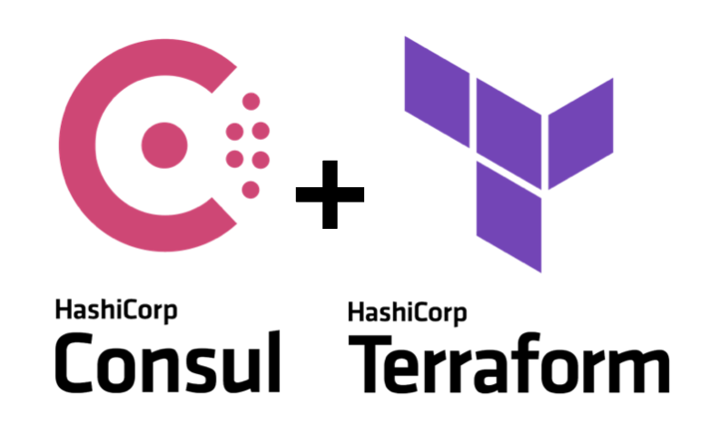

name: title
class: title, bottom
background-image: url(../../assets/images/backgrounds/HashiCorp-Content-bkg.png)
background-size: cover
count: false

# Consul-Terraform-Sync

## Network & Security Infrastructure Automation

<!-- Image example -->

???

<!-- Presenter notes go here -->
Welcome everyone

Introductions

We will be discussing Consul-Terraform-Sync and the benefits it provides.

<mark>This presentation assumes the audience has experience with Terraform and is currently using or considering running a Consul service catalog! If the audience is not familiar with both Terraform and Consul, this is not the appropriate presentation.</mark>

---
